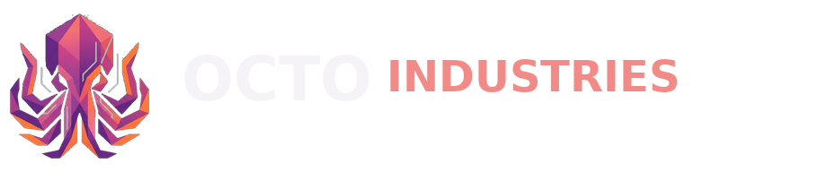
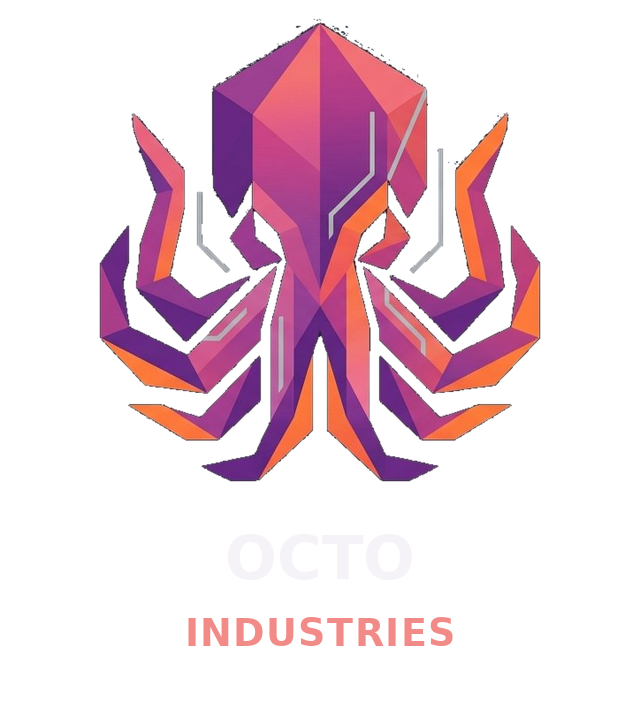
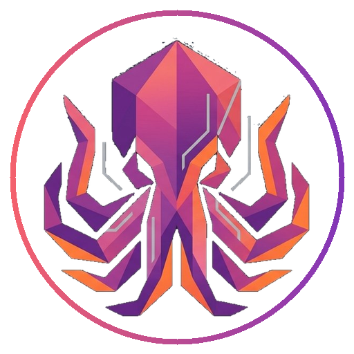
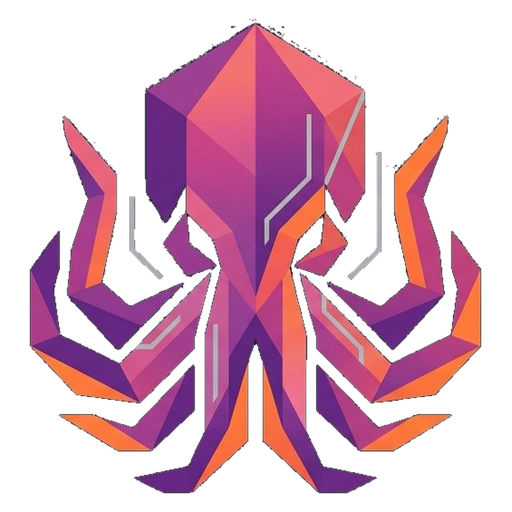

# Octo Industries™ Game Hub

Octo Industries is a static, touch-friendly game launcher. The repository-root `index.html` is the homepage and works with GitHub Pages, Codespaces, and other static hosts. No frontend framework or runtime service is required.

## Run the hub

The project tools and hub source live together in `Octo-Industries/BehindTheScenes/`. In VS Code, open **Run and Debug**, select **Run Game Hub**, and press **F5**. This regenerates the game catalog, starts a local web server from the repository root, and opens the hub in your browser instead of trying to download the HTML file.

Alternatively, from the repository root, generate the game catalog and start a local web server:

```sh
npm --prefix Octo-Industries/BehindTheScenes run sync
python3 -m http.server 8080
```

Open `http://localhost:8080/`. Run the server from the repository root, not from inside a game folder. The root page loads the hub assets from `Octo-Industries/BehindTheScenes/hub/`, links to each validated game entry point, and displays missing cover art with a local fallback.

## Discover and add games

`npm --prefix Octo-Industries/BehindTheScenes run sync` reads `game.json` metadata when available and automatically detects top-level game folders with an `index.html`. It validates launch paths and regenerates `Octo-Industries/BehindTheScenes/hub/catalog.js`. Manifest metadata supplies its title, description, category, tags, thumbnail, launch path, and optional featured status. Missing thumbnail files are allowed; invalid launch paths stop the sync with an error.

Add a game directory directly beneath `Octo-Industries/` with an `index.html`; the catalog sync automatically creates a title from the directory name, an `Other` category, basic tags, and a description. It looks for original promotional artwork named `logo`, `cover`, `title`, or `icon` (SVG, PNG, WebP, JPEG) and places it edge-to-edge in the shared 16:9 banner. It does not add generated titles or descriptions to the artwork and does not use gameplay screenshots. Add `game.json` with a curated `bannerSource` when artwork uses a different name; `bannerFit: "contain"` preserves transparent logo artwork, while the default cover fit fills the banner. The generated `hub-banner.svg` embeds its source art, so it loads offline at a consistent aspect ratio. The sync runs locally with `npm --prefix Octo-Industries/BehindTheScenes run sync` and automatically during Render deployment.

## Game projects

- `Octo-Industries/Block-Blast/` — Unity WebGL puzzle game.
- `Octo-Industries/Endless-Siege/` — HTML5 tower defense game.
- `Octo-Industries/Idle-Mining-Empire/` — locally hosted original HTML5 idle-mining game.
- `Octo-Industries/Ragdoll-Archers/` — Unity WebGL archery game.
- `Octo-Industries/Stickman-Hook/` — browser-based swinging platform game.
- `Octo-Industries/Toss-The-Turtle/` — Flash game launched locally by the bundled Ruffle player.

The existing `Octo-Industries/BehindTheScenes/` folder contains the hub, scripts, and project configuration alongside the game folders. The playable project folders above are the current copies used by the hub.

Every Play link opens the launch path from the generated catalog as a regular static route. The hub stores recently played game IDs in local browser storage; it does not require an account or send play history to a server.

## Hosting

The root `render.yaml` configures a Render Static Site to run the catalog sync and publish the repository root (`.`), where `index.html` lives. The build has no package dependencies; it uses Node.js to refresh `Octo-Industries/BehindTheScenes/hub/catalog.js` before the static files are published. Connect the repository to Render and use the Blueprint to apply these settings. Keep `index.html`, `Octo-Industries/`, and `render.yaml` together in the deployed branch.

Run `npm --prefix Octo-Industries/BehindTheScenes run sync` after changing game metadata or adding a game, and commit the generated `Octo-Industries/BehindTheScenes/hub/catalog.js` with the static site. The sync script validates game launch paths before writing the catalog.

## Branding assets

The existing artwork in `Octo-Industries/branding/octo-industries-logo-source.jpg` remains the source of truth. The transparent, color-preserving octopus cutout powers the complete logo system:

- `primary-logo.svg` / `.png` — stacked octopus and wordmark for splash screens and branding.
- `horizontal-logo.svg` / `.png` — octopus plus wordmark for hub headers and navigation.
- `home-button.svg` / `.png` — circular, text-free, clickable in-game home mark.
- `icon-only.svg` / `.png` — octopus-only icon for app marks, badges, and metadata.
- `watermark-logo.svg` / `.png` — transparent, text-free watermark artwork.
- `favicon.svg`, `favicon.png`, and `favicon.ico` — browser and app icon sizes, including `apple-touch-icon.png`.

Game pages use the circular home button, linking back to the hub, and a non-interactive icon-only watermark at 15% opacity. The shared corner defaults are configured in `game-branding.js` through `window.OCTO_GAME_BRANDING_CONFIG` (`hubButtonPosition` and `watermarkPosition`); changing them updates every game that loads the shared overlay. Players can still drag the home button to any corner; that personal preference is saved and shared between games. Keyboard users can focus the button and use the arrow keys to change corners. The shared overlay is maintained by `game-branding.css` and `game-branding.js`. Keep the branding directory with the game projects when hosting or packaging the site.

| Logo variant | Preview |
| --- | --- |
| Primary |  |
| Circular home button |  |
| Icon only |  |
| Watermark |  |
| Horizontal hub logo |  |
